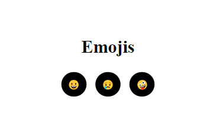
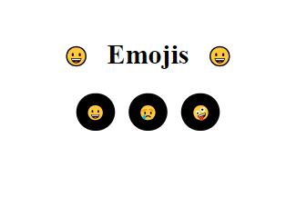
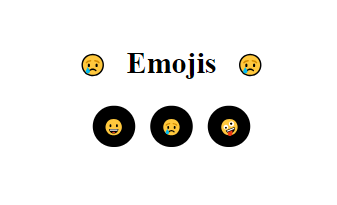
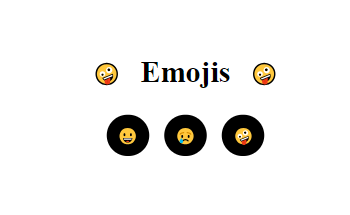
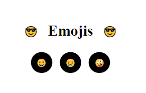

# Exercise Emojis Angular

## Technologies

Angular, html, sass

## Description
The icon changes if the user press smile button, cry button or crazy button. If user clicks in title content the icon changes to the sunglasses icon.
In this exercise we work with events, conditionals, arrays and life cicles.

### Initial program

### Smile button

### cry button

### crazy button

### When user clicks title content

